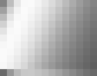

# The klear File Format and Command Line Utility

The `klear` file format standardises our way to store animation data for motors
and/or lights in installations. `klear` stands for: Kinetic Light Engine
Archive. 

This document describes the Kinetic Light Engine File Format which contains
Choreographies and all data needed for playing it.  This repo also contains the
*klear* ruby gem which provides library code and the `klear` command line
utility to create and manage the choreographies. It was originally developed as
part of the [Manta Rhei project][1] and is now continued for generic use.  

*(background: The gem is the starting point for refactoring the Manta Rhei
code. The repo contains all code for handling the actual content while running
actuall motors or driving the DMX lights is part of the kinetic-light-engine.)*

[1]: http://www.artcom.de/en/projects/project/detail/manta-rhei/

## The Data

Kinetic or Light installations have in common that a number of values are animated over time. For kinetic installation this can be the motor positions, for lights this usually is brightness, or can be RBG color, when 3 values are combined. The klear format uses PNG images to store this data. Each image is a two-dimensional grid, and animation than can be stored as sequence of images. For the images the PNG file format was choosen so that this data can be easily read and written on a variaty of platforms with available software. To store animation data as images also makes it possible to *preview* installation animations on a normal computer screen with a normal image viewer. (please see image format details further down). Which pixel in an image describes which axis or light is left up to the *player* software and not part of the klear format definition.

## The File

A `klear` file simply is a ZIP archive with a different filename extension. An archive format was choosen in order to keep related information being stored together in a single file. ZIP as a archiving (and compression) standard was choosen to make klear fileseasily managable on a lot of different platforms without the need for proprietary software. 

## Naming Convention

Files of this format should have the file extension `.kle` or `.klear`, e.g.
"simple-wave.klear".

## Layout and container Structure

A .kle File contains multiple assets, incl. source PNGs, metatdata and a
derived binary file containing frames in packed binary form. The Container
Format is ZIP so a .kle file is just a zip-file containing files and folders.

**Directory Layout**

+ *DIR* 'META-INF' (mandatory)
    + 'kle.yml', YAML file containing meta-data describing aspects like
      framerate & more
    + 'MANIFEST.MF' containing meta-data about the klear file itself (e.g.
      format version)
+ *DIR* 'frames' (mandatory)
    + Source PNGs files which were used to generate the kle
+ *DIR* cache' (optional)
    + 'frames.bin', binary file containing data derived from the PNGs during
      creation
    + further pre-processed data or application state for optimized restarts
      might be stored here.
+ *DIR* 'icon'
    + 'normal.png', PNG file for a normal sized icon (150 x 110 px)

## Workflow

The initial source of a klear file is a sequence of PNGs + metadata. Those are
used to generate a .klear file, including the 'frames.bin'. The metadata is
stored in 'META-INF/kle.yml'.

If a klear-file does not have a frames.bin in its cache directory it can be
regenerated. This is also useful for future format changes together with the
manifest to detect if a frames.bin is deprecated and needs to be regenerated.

The source sequence of PNGs is stored in the klear-file as well. Having the source
PNGs included with the archives allows for resampling of `frames.bin` and other
manipulations later on.

## Mapping data to PNGs

Each single PNG represents exactly one frame and is stored with 16-bit Gray per 
channel. For visual convenience we can define the pixel scale, which means we can control how many pixels are actually stored per value. Otherwise a 100 (10 by 10) axis system would only be 10 by 10 pixel in size. By setting the pixel scale to 20, such images would be upscaled to 300 by 300 pixel which can be handliy reviewed on screen. Pixel scale absolutly now effect on the animation data itself (when using standard tools to scale or zoom imagage data care must be taken to avoid unwanted pixel value interpolation).

**Example**

For the manta rhei installation we had 14 blades with 10 lights and one motor per blade. The natural mapping was to put this into 14 x 11 (=10 + 1) images where a column represents the state of a blade at a frame (a certain point in time). The number of columns represents the number of blades. By convention we use row 0 for the motor position on a blade and row 1 to 11 for the 10 lights on a blade. For better visual check the pixel scale is 10 x 10, making this a 140x110 pixel image per frame.

* We have 11 rows and 14 columns (blades)
* bottom row describes the motor state
* Upper rows describe the state of the lights from one direction to the other
* The PNG is 140px by 110px in size.

## PNG Sequence Order 

The order of the sequence is determined by the **intuitiv** numerial order of the file names. This is done by extracting digits from the filenames and than sort them numerial. This is different than the directory listing order in some cases where the frame number is embedded in the filename or is not padded with a leading zero. When no frame numbe is present in the filenames the sorting is in normal alphabetical order.

*Examples*

* `A.png, B.png, X.png` is valid sequence of 3 PNGs
* `Test_0001.png, Test_0002.png, Test_1000.png` is a valid sequence

A sequence does not need to be consecutive (it can have gaps e.g.
`01.png,10.png` is valid and the existence of e.g. 05.png is not enforced).

*Sequence Order:* 

      ls -1 (shell order) | intuitive Animation Order
    ----------------------+-------------------------------------
      frame_1.png         | frame_1.png      
      frame_10.png        | frame_2.png     
      frame_100.png       | frame_10.png    
      frame_12.png        | frame_12.png     
      frame_2.png         | frame_100.png      

The number of columns and rows must be the same for all PNGs.

## kle.yml

Contains information fields about how to use the frames:

 * Number of columns and rows (geometry)
 * Frames per second
 * recommended gamma value
 * pixel scale for the input PNGs
 * descriptor (optional)

The geometry is determined automatically by reading the first png in the png
sequence and dividing width and height by 10 respectively. This relies on one
tile in the png being 10x10px in size.

*Example:*
<pre>
---
 description: calm_02
 geometry:
   rows: 11
   columns: 14
 fps: 25
</pre>

## Klear file version 1.1 format update

*Kle-Version: 1.1*
<pre>
 pixel_scale:
 - 30
 - 30
</pre>

In version 1.1 the pixel_scale attribute is added which was fixed to 10px pixel before. The pixel scale defines the amout of pixels per axis, default value is 10px. This means a 10x10 pixel square in the input PNG stands for one axis. For easier visibility now pixel scale can be manually overwridden. For installations with few axises, for example 10 by 2, it might be reasonable to define pixel scale as 30. This would result in a PNG size of  300 by 60 pixel, which is much easier to review on the computer screen than a 10 by 2 pixel image.  

## MANIFEST.MF

The manifest contains meta information about the file and file format itself:

 * `Manifest-Version` Version of the manifest itself
 * `Kle-Version` Version of the kle-file format (e.g. `1.0`)
 * `Created-By` Tool which created this file.

*Example:*

<pre>
Manifest-Version: 1.0

Kle-Version: 1.1
Created-By: bin/klear (0.1.5)
</pre>

## frames.bin

The frames.bin binary file contains the extracted 16-bit values sampled from
each tile of the PNGs. It contains all frames and each frame contains all
columns and rows.

Each 16-bit value is saved as unsigned 16 bit integer big endian (network byte
order) and uses 2 bytes in frames.bin.

A PNG with 11 rows and 14 columns uses `14 x 11 x 2 bytes = 308 bytes`.

Each frame is encoded rows bottom to top and the columns from left to right.

Example of a PNG with 3 rows & cols:

      col 1   col 2   col 3
    |-------|-------|-------|
    | 27009 | 38885 | 47331 | <- row 3
    |-------|-------|-------|
    | 51027 | 51233 | 49789 | <- row 2
    |-------|-------|-------|
    | 47645 | 45039 | 41857 | <- row 1
    |-------|-------|-------|

is written as a sequence of values like:

    47645 45039 41857    51027 51233 49789    27009 38885 47331

which results in a binary big endian (network) byte order sequence like:

    0xBA1D 0xAFEF 0xA381    0xC753 0xC821 0xC27D    0x6981 0x97E5 0xB8E3

*(note: row 1 is the motor state by convention)*

## Command Line Usage

For ruby users this gem contains the klear command line utility to manage klear
files. 

** Installation **

    $ gem install klear

**File info**

    $ klear info choreo.kle

dumps archive content info to stdout.
 
**New File Generation**

*Notice: file generation depends on jruby because of its usage of Java JAI*

Klear files are zipped directory structures which are generated from a set of
images. The pixel values directly map to motor position and light intensity.
On top of that, the klear file contains some additional meta info and cache
date to speed up its loading at runtime. Generating a klear file from a images
sequence in a directory goes like:

    $ rvm jruby exec ./bin/klear.rb generate image_sequence_dir outfile.kle
    
and of course, more documentation needs to come.

